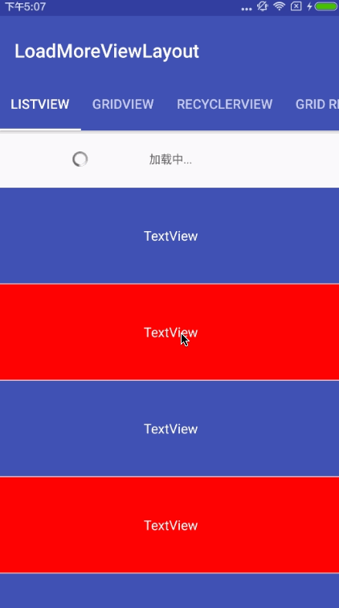

###### 欢迎关注我

GitHub : https://github.com/zhangman523

Blog   : https://zhangman523.github.io

---

# LoadMoreViewLayout

这个项目是作为 [Ultra Pull To Refresh]("https://github.com/liaohuqiu/android-Ultra-Pull-To-Refresh") 的`上拉加载`补充功能。

- 支持所有的View：

    `ListView`、`GridView`、`RecyclerView`、`ScrollView`、`WebView`、`FrameLayout`、`RelativeLayout` 等

